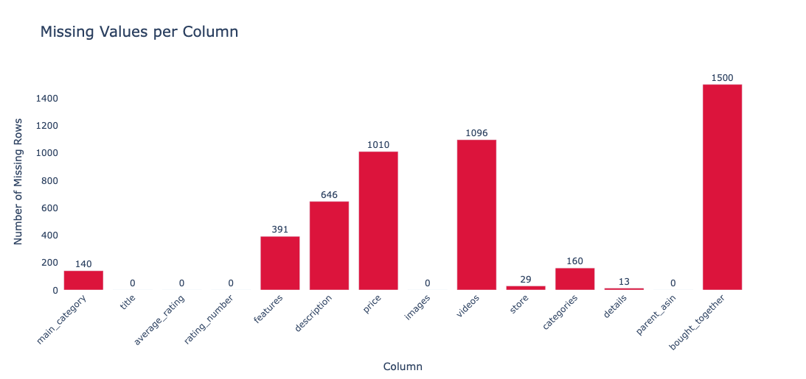
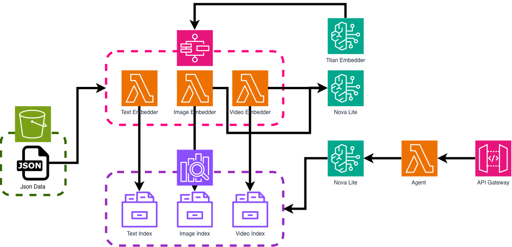
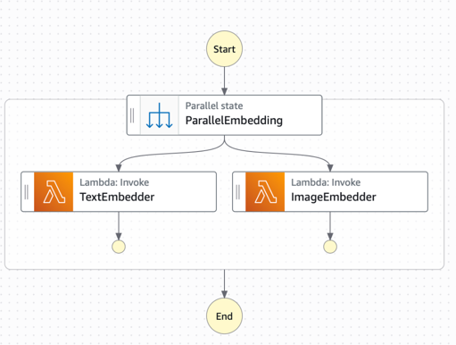
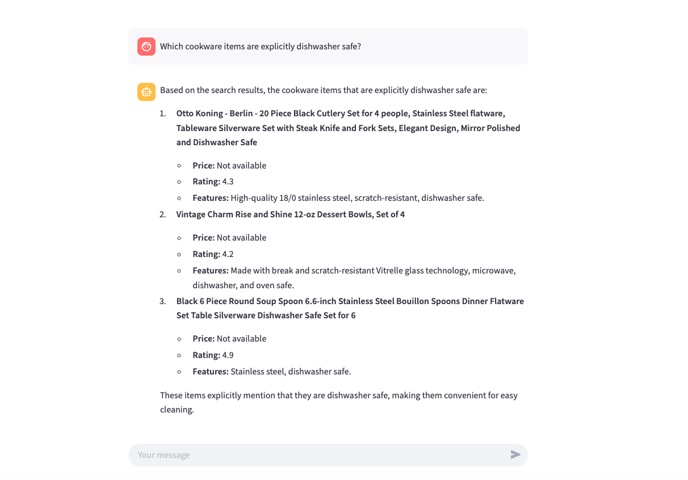

# ahmed-bshg-case-study

## Overview

### Solution Summary

This repository contains the solution for the Senior Data Scientist Case Study for BSHG solved by me, Ahmed Abunada. Overall the problem is the development and building of a RAG system that is used to communicate with product data and avoid any hallucinations when retrieving data. My Solution is a **complete cloud** implementation, meaning the entire end to end project leverages and runs on AWS, using resources, processes and technologies to implement successfully.

The solution works to gain the most information from the data by splitting the data into 3 separate parts:
* Text Data
* Image Data
* Video Data

The reason for doing this is that any potential questions that describe its shape or uses might be better described in a picture/video, and the agent will be able to search specifically among what it needs. With this approach, separate embeddings are created for text, images and videos.

## Repository Structure

```
ahmed-bshg-case-study/
├── README.md
├── SeniorDataScientistCaseStudy.pdf
├── Analysis/
│   └── Full Analysis.ipynb
├── Application/
│   ├── app.py
│   └── requirements.txt
├── Data/
│   └── data.jsonl
├── Resources/
│   ├── requirements.txt
│   ├── lambda_libraries/.../
│   ├── image_embedder_lambda/
│   │   └── lambda_function.py
│   ├── invoke_agent_lambda/
│   │   └── lambda_function.py
│   └── text_embedder_lambda/
│       └── lambda_function.py
└── Terraform/
    ├── main.tf
    ├── variables.tf
    ├── terraform.tf
    ├── api_gateway.tf
    ├── iam.tf
    ├── lambda.tf
    ├── opensearch.tf
    ├── s3.tf
    └── step_functions.tf
```

The repository is split into 5 main sections:
1. **Analysis Notebook:** A jupyter notebook with all the EDA and initial scripts written for all of the functions and tools used, found under Analysis/
2. **Application:** A Streamlit chat UI that calls the invoke API so users can ask product questions in a browser
3. **Lambda Functions:** Code for all 3 lambda functions used in the project, stored under Resources/ along with their requirements and packages
4. **Data:** Directory to store data and documentation resources
5. **Terraform Project:** Terraform files that are used to build resources on AWS, the backend is currently set to local.

## Technology Stack & Justifications

### Cloud Provider
The cloud provider selected for this project is AWS, this is mainly due to personal preference as I have extensive experience using AWS, as well its resources align greatly with project requirements. The resources used in AWS are:
* Opensearch Vector DB
* Bedrock Models
* Lambda Functions
* API Gateway
* Step Functions
* *among others*...

### Vector Database
The vector database selected is the AWS OpenSearch Service, which is an AWS managed service that lets us run and scale OpenSearch clusters with strong analytical capabilities. The reasons this was chosen for our vector DB, especially for **KNN semantic embedding search**, are as follows:
1. **Native to AWS.** Integrates with Bedrock, Lambda, and IAM without extra overhead.
2. **Built-in KNN support.** OpenSearch provides a `knn_vector` field type and KNN search APIs, so we can store high dimensional embedings and run nearest-neighbour queries by similarity without building a separate vector store.
3. **Semantic search fit.** KNN over embeddings gives us meaning-based retrieval: the query is embedded with the same model as the documents, and the top‑k nearest neighbours are the most semantically similar products, which is exactly what the RAG agent needs for context.
4. **Unified storage.** We keep both the embedding vector and the product metadata such as title, category and price in the same document, so a single KNN query returns the full context for the LLM without a second lookup.

The reason a KNN semantic approach was chosen is that this approach benefits from meaning similarity between a user query and data found in our index. 

Vector Database Alternative: One alternative that could be used here is AWS Aurora PostgreSQL with pgvector, which is a relational database that can leverage similar embedding representation and searches.
### Embedding Model
The embedding model selected is Amazon Titan Embed Text v2, used for all text and image derived content in this solution. The reasons this was chosen are as follows:
1. **Available on Bedrock.** It runs on the same AWS Bedrock stack as the rest of the pipeline, so we avoid external embedding APIs and keep latency and cost predictable.
2. **High dimensional output.** It produces 1024 dimensional vectors with normalisation, which gives a rich representation for semantic similarity and aligns well with OpenSearch KNN search using inner product.
3. **Single embedding space.** We use the same model for product text and for image description text, so both live in one embedding space and the agent can run one type of KNN query across text and image indices for consistent semantic retrieval.
4. **Suited to product data.** It is built for general purpose semantic embedding, which fits product titles, features, descriptions and visual descriptions without needing a custom model.

Embedding Model Alternative: Cohere Embed v3 on Bedrock is a strong alternative, as it is tuned for retrieval and e-commerce style product search and supports multilingual queries out of the box. 

Note: The reason cohere was not selected is that it is significantly more expensive than titan.

| Model | Price per 1,000 tokens |
|-------|------------------------|
| Titan Embed Text v2 | $0.00002 |
| Cohere Embed v3 | $0.0001 |

### Agent LLM
The agent LLM selected is Amazon Nova Lite on AWS Bedrock, which drives the RAG conversation and calls the retrieval tools before answering. The reasons this was chosen are as follows:
1. **Available on Bedrock.** It runs on the same AWS stack as the embedding model, so we keep the pipeline within Bedrock and avoid extra integrations or latency.
2. **Native tool use.** It supports Bedrock tool use and function calling, so we can define the text and image search tools and have the model decide when to call them and how to combine the retrieved context into an answer.
3. **Cost effective.** Nova Lite is a lighter model than Nova Pro or Claude, which keeps inference cost low for a case study while still giving good instruction following and tool use for product Q&A.
4. **Fits RAG use case.** It is well suited to question answering over retrieved context, so the agent can ground answers in the product data from OpenSearch and reduce hallucinations.

Agent LLM Alternative: Claude 3 Haiku or Claude 3/4 Sonnet on Bedrock are strong alternatives if higher quality or longer context is needed, at a higher per token cost.

### Compute
The compute layer is AWS Lambda, used for embedding, indexing and agent invocation. Two main benefits:
1. **Fully managed.** No servers to run or patch; we only deploy code and pay per invocation, which keeps the setup simple for this scope.
2. **Easy to deploy and develop.** Each piece of logic lives in a small Lambda, so we can iterate quickly and deploy via Terraform. For larger datasets, the 15 minute Lambda limit may require moving to containerised workloads on ECS.

Compute Alternative: Dockerise the processing scripts, push to ECR and run on ECS or Fargate for long running or bulk jobs.

### Orchestration
Data processing is orchestrated with AWS Step Functions so text and image embedding run in parallel before indexing into OpenSearch. Two main benefits:
1. **Native to AWS.** Step Functions is a managed service that fits the rest of the stack and avoids running our own scheduler.
2. **Integrates with Lambda and other services.** We define the workflow in state machine definitions and invoke Lambdas at each step, with retries and error handling built in.

Orchestration Alternative: Apache Airflow if we need more complex DAGs or richer scheduling.

### IAC
Infrastructure is defined and deployed with Terraform. Two main benefits:
1. **Declarative and versioned.** All resources are in code, so we can review changes, roll back and replicate the environment consistently.
2. **Provider ecosystem.** The AWS provider gives us a single tool for OpenSearch, Lambda, Step Functions, API Gateway and IAM, keeping the whole stack in one place.

## Data Handling & Processing

Data is processed and cleaned in stages before being indexed in OpenSearch. The approach is split into four areas: exploratory analysis, text, images, and videos.

### EDA

An exploratory analysis was done to understand missingness and data quality. Missing values per column were computed, treating empty lists as null where relevant, and visualised to decide which columns to keep or drop.



The plot shows that **bought_together** is fully empty, and that **videos** and **price** have high missingness. **bought_together** was dropped from the pipeline because it adds no signal. Remaining columns were kept and handled in the text/image/video pipelines, for example optional fields and null-safe serialisation.

#### Text Data

Product text is turned into a single JSON document per product and then embedded for semantic search.

**Building the embedding text**

Each row is mapped to a JSON document with fields such as `parent_asin`, `title`, `main_category`, `store`, `price`, `average_rating`, `rating_number`, `features`, `description`, `categories`, and `details`. The string sent to the embedding model is built by simply combining title, main category, features, and description into one space-separated string. Empty or missing fields are passed as empty strings and filtered out before joining:

```python
def build_embedding_text(json_data):
    embedding_text = [
        json_data.get("title") or "",
        json_data.get("main_category") or "",
        " ".join(json_data.get("features") or []),
        " ".join(json_data.get("description") or []),
    ]
    
    price = json_data.get("price")
    if price is not None and not (isinstance(price, float) and np.isnan(price)):
        embedding_text.append(f"Item price: {price}")
    
    embedding_text.append(_details_to_text(json_data.get("details") or {}))

    return " ".join(filter(None, embedding_text))
```

**Data cleaning**

Missing data was kept as missing. Fields such as `description` or `features` can be null or empty; the embedding text still works because we use empty string defaults and filter out empty parts, so the model receives a shorter string for sparse products. Embeddings remain meaningful at this document size. No explicit text cleaning was applied: no HTML elements were found in the data, and emojis or unusual characters were left as-is, since users may ask about product names or descriptions that contain them and we want the index to match those queries.

**Chunking**

No chunking was used for product text. Each product is one document and one embedding. The length of the embedding text per product in the dataset is summarised below in characters:

| Statistic | Length characters |
|-----------|----------------|
| count     | 1500           |
| mean      | 943.15         |
| std       | 840.94         |
| min       | 14             |
| 25%       | 216.5          |
| 50%       | 747            |
| 75%       | 1434.5         |
| max       | 8930           |

**Amazon Titan Embed Text v2** accepts up to **8,192 tokens** or **50,000 characters**, whichever is reached first. The maximum length in our data, 8,930 characters, is well below the model limit, so every product fits in a single input and chunking was not required. At the current description and feature lengths, the embedding model captures the full content in a single vector. For very large descriptions in a production setting, we would want to chunk and embed each chunk separately so that long documents do not get under-represented in similarity search.

**Embedding**

The concatenated text from `build_embedding_text` is embedded with **Amazon Titan Embed Text v2**, model id amazon.titan-embed-text-v2:0, with 1024 dimensions and normalisation. The resulting vector is stored in the document and indexed in the text OpenSearch index for KNN search.

### Image Data

Images are not embedded directly; they are first described in text, then that text is embedded.

- **Description:** Each product image, such as the MAIN variant, is sent to **Amazon Nova Lite** with a prompt asking for a detailed product description: appearance, colours, materials and notable visual features. The model returns a short text description. Example output for a product image:

  > The image showcases a pair of rustic wooden shelves against a plain white background. Each shelf is crafted from weathered wood, giving it a natural and earthy appearance with visible grain patterns. The shelves are supported by sleek, black metal brackets that add a modern contrast to the wooden aesthetic.
  >
  > On the top shelf, there is a framed picture with a black border, displaying a photograph of a person in an indoor setting. The picture adds a personal touch and complements the rustic theme of the shelves.
  >
  > The lower shelf features a wooden figurine of a bear playing a guitar, adding a whimsical and charming element to the setup. The figurine is placed on a small, natural-colored log, enhancing the rustic feel.
  >
  > Next to the figurine, there is a white ceramic vase with a minimalist design. The vase contains a small bouquet of flowers, consisting of red and white blooms, which provides a splash of color and freshness to the overall arrangement.
  >
  > The arrangement of the items on the shelves is balanced, with the picture frame on the top shelf, the bear figurine and log on the lower shelf, and the vase of flowers completing the ensemble. The combination of natural wood, metal, and floral elements creates a cozy and inviting display.

- **Storage:** For each image we store a JSON document with `parent_asin`, `variant`, the Nova-generated `description`, and an `embedding` field. Documents are written to the image OpenSearch index in the same way as text, for example bulk indexing with chunking.
- **Embedding:** The image description text is embedded with the **Amazon Titan Embed Text v2** model, the same as for text, so image and text data live in a shared embedding space and can be queried with the same semantic search setup.

### Video Data

Video ingestion was not implemented in this solution.

- **Reason:** Processing and describing video would cost a lot of money for just this case study, hence I skipped it.
- **Planned approach:** Videos would be described with a multimodal model such as **Pegasus** on AWS, with chunking for long videos. The resulting text would be embedded with the **Titan Embed Text v2** model and stored in OpenSearch in the same way as text and image documents, so the agent could search them via the same KNN interface.

## Implementation

### Summary

### Solution Architecture


### Architecture Components

#### 1. Vector Database

The vector database is AWS OpenSearch Service. The agent embeds the user question with Titan, then runs KNN search so that the query vector is compared against document embeddings in the index; the nearest neighbours by inner product are returned as context. There are three indices: products_main for product text and metadata, products_images for image descriptions, and products_videos for future video derived text.

**Text index: products_main**

- Holds product metadata and text: title, category, features, description, price, ratings.

```json
{
  "parent_asin": "B092W84VKC",
  "main_category": "Amazon Home",
  "title": "ShineeKee Soild Wood Floating Shelves Set of 2 Wall Mounted Shelves Rustic Storage Wall Shelf Thick Natural Wood Floating Wall Shelves for Laundry Room Living Room Bedroom Kitchen Bathroom-16 x 5.5\"",
  "average_rating": 4.4,
  "rating_number": 66,
  "price": null,
  "store": "ShineeKee",
  "features": [
    "\u3010100% US HOMEGROWN PINE WOOD\u3011It can be proud to say that our wood board is 100% sourced from authentic pine wood in native American forests, exuding the fragrance of pine wood. Clear wood texture and unique craftsmanship create a retro style. Package includes 2pcs wooden shelves and necessary hardware. Each shelf measures 16\" x 5.5\" x 1.2\" inches, thick wood boards and solid brackets provide powerful load bearing capacity, can securely hold up to 40lbs, perfect for home decoration and storage.",
    "\u3010UPGRATED 2 TYPES WALL ANCHORS\u3011Unlike others' single installation that only applies to hard walls, we have thoughtfully prepared two types of wall anchors to apply to both hard and soft walls. White Anchors for Soft Wall (Drywall/Gypsum/Wallboard/Sheetrock Wall). Yellow Anchors for Hard Wall (Concrete/Brick/Plywood Wall). Package comes with detailed installation instructions to make your shelf installation a breeze. Enhance the aesthetic appeal of your interior space with our wood wall shelves.",
    "\u3010HANDCRAFTED CARBONIZED WOODEN SHELVES\u3011We always uphold the spirit of craftsmanship, hand craft every shelf in our wood workshop, and are committed to providing customers with high-quality craftsman-style shelves. Each of our rustic shelves has been carbonized at 600\u00b0F and brushed to achieve the function of compression, waterproof and corrosion resistance. The two corners of the shelf are decorated with metal reinforcement, which effectively protects the board and adds a retro and noble beauty.",
    "... (2 more)"
  ],
  "description": null,
  "categories": [
    "Home & Kitchen",
    "Home D\u00e9cor Products",
    "Home D\u00e9cor Accents",
    "... (1 more)"
  ],
  "details": {
    "Material": "Pine",
    "Mounting Type": "Wall Mount",
    "Room Type": "Office, Bathroom, Living Room, Bedroom",
    "Shelf Type": "Wood",
    "Number of Shelves": "2",
    "Special Feature": "Waterproof, Durable",
    "Product Dimensions": "16.26\"D x 5.53\"W x 2.48\"H",
    "Shape": "Rectangular",
    "Style": "Country Rustic",
    "Age Range (Description)": "Adult",
    "Brand": "ShineeKee",
    "Product Care Instructions": "Wipe with Dry Cloth",
    "Size": "16\"L x 5.5\"W",
    "Assembly Required": "No",
    "Recommended Uses For Product": "Bathroom, Kitchen, Living Room, Bedroom",
    "Number of Items": "2",
    "Manufacturer": "ShineeKee",
    "Installation Type": "Wall Mount",
    "Item Weight": "4.44 pounds",
    "Item model number": "SK-FSHS-16-2Pcs",
    "Best Sellers Rank": {
      "Home & Kitchen": 1430082,
      "Floating Shelves": 3914,
      "Storage Racks, Shelves & Drawers": 5418
    },
    "Date First Available": "October 1, 2021"
  },
  "embedding": "... (1024 items)"
}
```

**Image index: products_images**

- One document per product image; Nova Lite generates the description text, then Titan embeds it.

```json
{
  "parent_asin": "B08N5WRWNW",
  "variant": "MAIN",
  "description": "Black over-ear headphones, cushioned ear cups, Sony branding.",
  "embedding": [0.01, -0.30, 0.54, "..."]
}
```

**Video index: products_videos**

- Reserved for future video pipeline; same embedding setup as text and image indices.

```json
{
  "parent_asin": "B08N5WRWNW",
  "title": "Unboxing and Setup",
  "duration": 342,
  "user_id": "USR_A3X9KLP",
  "description": "Unboxing, pairing demo, noise cancellation test.",
  "embedding": [0.03, -0.27, 0.59, "..."]
}
```

#### 2. Data Processing Step Function

The Step Function runs the text and image embedding pipelines in parallel. It receives an input payload containing the S3 key of the product data file and invokes both the text embedder and image embedder Lambdas with that key, so a single run can backfill or refresh both the text and image OpenSearch indices from the same source file.



#### 3. Data Processing Lambda Functions

##### Text Data Lambda Function

The text embedder Lambda reads product data from S3, turns each row into a JSON document with an embedding, and bulk indexes into the text OpenSearch index.

Logical steps:

1. **Load data from S3.** Read the object key from the event, fetch the file from the bucket, and parse as JSON or JSONL into a dataframe.
2. **Build JSON data.** Map each row to a product document with cleaned fields such as parent_asin, title, main_category, features and description.
3. **Get embeddings.** For each document, build the embedding text via `build_embedding_text`, call Titan Embed Text v2, and attach the vector to the document.
4. **Push data to OpenSearch.** Bulk index the documents into the text index in chunks with a short delay between chunks.

##### Image Data Lambda Function

The image embedder Lambda reads the same product data from S3, selects rows that have images, describes each MAIN image with Nova Lite, embeds the description with Titan, and bulk indexes into the image OpenSearch index.

Logical steps:

1. **Load data from S3.** Read the object key from the event, fetch the file, and parse as JSON or JSONL into a dataframe.
2. **Extract image tasks.** Filter rows with an `images` field, collect each MAIN variant image per product as parent_asin and image_data.
3. **Describe and embed.** For each image, fetch the image from its URL, send it to Nova Lite for a text description, embed that description with Titan, and build a document with parent_asin, variant, description, and embedding.
4. **Push data to OpenSearch.** Bulk index the image documents into the image index in chunks.

### LLM Agent Inference Lambda

The invoke agent Lambda handles user questions by calling Amazon Nova Lite on Bedrock with tool use. It passes the question to the model, runs any requested retrieval tools against OpenSearch, and returns the model’s final answer so the client gets a single RAG response.

Logical steps:

1. **Parse request.** Read the event or request body and extract the required question field.
2. **Invoke the agent.** Send the user message to Nova Lite with the system prompt and tool definitions for query_text_index and query_image_index.
3. **Handle tool use.** If the model returns tool_use, run each requested tool, append the results to the conversation and invoke the model again; repeat until the model returns end_turn with a final answer.

#### 4. API Endpoint
The Agent Inference Lambda is fronted by an API gateway, which acts as an endpoint that users can communicate with, this endpoint takes the question submitted by the user and feeds it into the lambda function. Then, the agent response is returned to the user through the api endpoint. This allows for a REST approach, allowing easy integration for our agent into any system or workflows.

Bellow is an example of how to send a request to the endpoint:

```shell
curl -X POST "https://hm3yewg3c8.execute-api.eu-central-1.amazonaws.com//invoke" \
  -H "Content-Type: application/json" \
  -d '{"question": "Do you have any air fryers that are dishwasher-safe?"}'
```

#### 5. Streamlit Application

A simple chat interface is provided under `Application/` so users can talk to the RAG agent in a browser. The app uses Streamlit and sends each user message to the same invoke API endpoint used by the curl example above. Conversation history is kept in session state for the duration of the run.

To run it locally, from the project root:

```shell
cd Application
pip install -r requirements.txt
streamlit run app.py
```

Then open the URL shown in the terminal (default http://localhost:8501). The app depends on the invoke API being deployed and reachable; the API URL is set in `app.py`.

### LLM Agent Inference

At query time, the user question is sent to the invoke agent Lambda, which uses **Amazon Nova Lite** on Bedrock with tool use enabled. The model can call one or both of the retrieval tools to fetch relevant products from OpenSearch before answering. The user question is embedded with Titan and compared against the text and image indices via KNN search; the tool results are returned as context so the agent can ground its reply in actual product data and avoid hallucinations.

The agent receives the list of tools below. It decides when to call each tool and with which question; the Lambda executes the tool, passes the result back into the conversation, and continues until the model returns a final answer. This RAG loop keeps responses tied to the indexed catalogue.

| Tool | Description |
|------|-------------|
| query_text_index | Search the product catalogue using a question. Returns matching products with titles, prices, ratings and features. |
| query_image_index | Search product images using a question. Returns matching images with visual descriptions. Use when the question is about appearance, colour, design or visuals. |

**Prompt grounding**

The agent is instructed via the system prompt to use only information returned by the tools when answering. It must not use its own knowledge to describe, recommend or invent product details. If the tools return no relevant results, it must say so and must not guess or fabricate information. This keeps every claim about products traceable to the retrieved catalogue and reduces hallucinations.

**Reference returning**

When the agent references a specific product, it is instructed to always cite the ASIN. The tool results already include ASIN, title, price, rating and features or image description per hit, so the model can both ground its answer in that context and surface those identifiers in its reply. That way the user gets a verifiable reference such as the ASIN to look up the product.

## Evaluation Set

>**NOTE:** In full transparency, the evaluation dataset was created using an LLM due to limited time, but however was verified manually

The prototype was tested against a manually created evaluation set of 20 question–answer pairs (`Data/validation_dataset.csv`) covering five intent types. Each question was sent to the live API:

```bash
curl -X POST "https://hm3yewg3c8.execute-api.eu-central-1.amazonaws.com//invoke" \
  -H "Content-Type: application/json" \
  -d '{"question": "<question>"}'
```

Below is one example per intent type, with the question, the chatbot answer, and whether it matched the ground truth from `data.jsonl`.

| Intent | Question | Result | Notes |
|--------|----------|--------|--------|
| **Feature-Specific** | Do you have any air fryers that have a ceramic-coated basket and are PFOA-free/BPA-free? | **Correct** | Returned the Yedi Evolution Air Fryer B08FBLZD8R with ceramic-coated basket and PFOA-free and BPA-free, matching the expected product and claims. |
| **Comparative** | What is the material difference between the All-Clad LTD 14-Inch Nonstick Fry Pan and the CAINFY Nonstick Grill Pan? | **Correct** | Correctly contrasted All-Clad with stainless-steel interior and hard-anodized aluminum exterior against CAINFY with multi-die cast aluminum and PFOA-free ceramic nonstick coating. |
| **Scenario-Based** | I'm looking for a durable, leak-proof bottle for day hikes that keeps drinks hot or cold. What would you recommend? | **Correct** | Recommended the Thermosteel Duo Deluxe Insulated Water Bottle B07G1D1RY6, matching the ground truth. It also listed other bottles that fit the scenario. |
| **Exclusionary** | Show me coffee makers that do not rely on paper filters. | **Incorrect** | Returned a coffee grinder and a reusable coffee cup instead of coffee makers. Ground truth was Wyndham House French Press B00AGG74QG and Bella One Scoop One Cup B009463PV2. Retrieval likely surfaced reusable or coffee items that are not brewers and the model did not restrict to actual coffee makers. |
| **Ambiguous** | What's a good pot for a new kitchen? | **Incorrect** | Responded that no pots were found and asked for more details. Ground truth included QStar saucepan B0B3SB783X or Swissmar fondue pot B000FDDV4O. Semantic search for pot may not match sauce pan or fondue pot in the index, or the agent gave up before combining partial matches. |

Failures on Exclusionary and Ambiguous intents point to retrieval, such as query formulation or KNN returning off-topic or too-narrow results, and possibly prompt design, such as instructing the agent to ask for clarification only when retrieval is truly empty.

## Future Improvements

### Hybrid Vector Search

The current pipeline uses only KNN over embeddings. Combining semantic search with keyword or BM25 search in OpenSearch would improve recall for exact matches such as product names, ASINs, or specific feature terms. A hybrid query could merge KNN and keyword scores so that both meaning and literal matches contribute to the ranked results.

### Other Semantic Approaches

OpenSearch supports approximate nearest neighbour search. For very large catalogues, switching to ANN with HNSW or IVF would keep latency low while still allowing semantic retrieval. Re-ranking the top K NN results with a cross-encoder or a small classifier could also improve precision before passing context to the LLM.

### Security

No security was explicitly added to the resources and infrastructure due to the small nature of the project. In production this would need rigorous security and permissions, for example authenticating API calls, least-privilege IAM for Lambdas and OpenSearch, VPC isolation for the cluster, and encryption at rest and in transit for data and embeddings.

### Monitoring

Production would benefit from metrics on API latency, Lambda errors and duration, Bedrock token usage, and OpenSearch query performance. CloudWatch dashboards and alarms could track these. Logging tool calls and retrieved document IDs would help debug retrieval and generation issues.

### Prompts

The prompts were developed quickly and were not set up with infrastructure for versioning or A/B comparison. A next step would be to store prompts in a config store or parameter store, version them, and run small eval sets to compare prompt variants before rollout.

### Automation

In a production deployment the data processing pipeline would run automatically when new data arrives or on a schedule. New or updated products in S3 could trigger the Step Function via EventBridge or S3 event notifications so that the text and image indices are refreshed without manual runs.

### Agent Session Memory

The agent is stateless and does not keep session memory. Adding it would allow follow-up questions and multi-turn recommendations. Options include storing conversation state in S3 or DynamoDB and passing the last N turns into the Bedrock request, or using an AWS-native solution such as Bedrock conversation memory or Agent for Amazon Bedrock.

### Videos and Image Processing

Video ingestion was not implemented. Finishing it would mean describing each product video with a multimodal model, embedding the description text with Titan, and indexing into the products_videos index so the agent can search video content. Image processing could be extended to more variants per product and to structured fields such as colour or material inferred from the image.